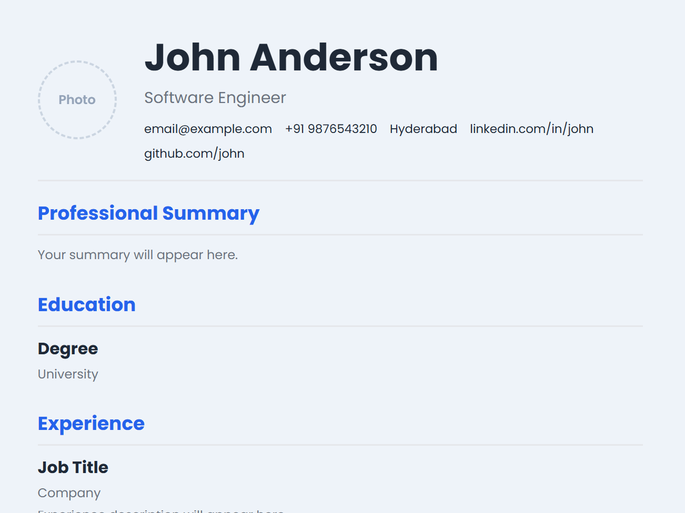
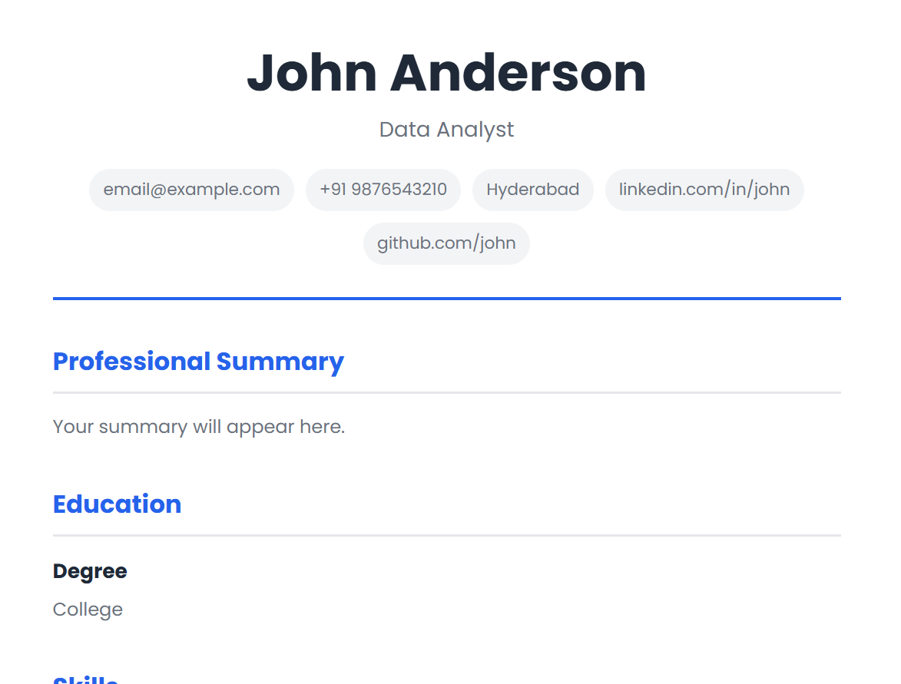

# Resume Builder

A clean, responsive, and customizable Resume Builder built using **HTML**, **CSS**, and **JavaScript**. Users can choose from multiple resume templates, fill in their details with live preview support, upload and crop profile photos, and export resumes as PDF.

---

## Features

- Two professionally designed resume templates
- Live resume preview
- Dynamic resume sections
  - Personal Details
  - Professional Summary
  - Education
  - Experience
  - Projects
  - Skills
  - Languages
  - Certifications
- Profile photo upload
- Built-in image cropping
- PDF export
- Responsive design
- Clean and modern user interface

---

## Templates

- Professional Resume
- Modern Resume

---

## Technologies Used

- HTML5
- CSS3
- JavaScript (ES6)
- CropperJS
- html2canvas
- jsPDF

---

## Folder Structure

```text
Resume Builder/
│
├── css/
│   ├── home.css
│   ├── main.css
│   ├── modern.css
│   └── professional.css
│
├── images/
│   └── previews/
│       ├── modern-preview.png
│       └── professional-preview.png
│
├── js/
│   ├── modern.js
│   └── professional.js
│
├── templates/
│   ├── modern.html
│   └── professional.html
│
├── .gitignore
├── index.html
├── LICENSE
└── README.md
```

---

## Screenshots

### Professional Resume



### Modern Resume



---

## Getting Started

### Clone the repository

```bash
git clone https://github.com/hasitapattapu/resume-builder.git
```

### Open the project

Open `index.html` using **Live Server** or any local web server.

---

## Usage

1. Choose a resume template.
2. Fill in your details.
3. Upload and crop your profile photo.
4. Preview your resume in real time.
5. Export your resume as a professional PDF.

---

## Live Demo

Coming Soon...

---

## Future Improvements

- Additional resume templates
- Dark mode
- Theme customization
- Auto-save using Local Storage
- Import and export resume data
- Multiple color themes
- Improved mobile experience
- ATS resume score checker

---

## Author

**Hasita Pattapu**

GitHub: https://github.com/hasitapattapu

---

## License

This project is licensed under the MIT License. See the [LICENSE](LICENSE) file for more information.